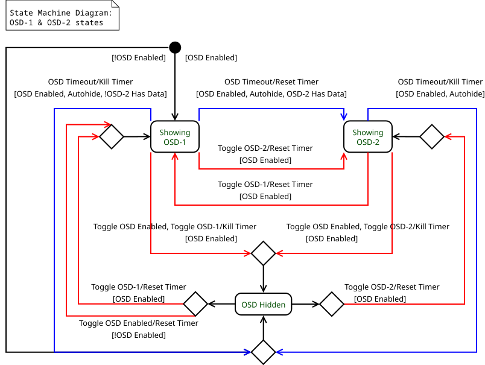

# Metadata OSD for mpv player
The script adds metadata OSD (on-screen display) to mpv.

## Installation & Configuration
Place the script `metadata_osd.lua` into directory `$XDG_CONFIG_HOME/mpv/scripts/` on Linux or (folder) `%APPDATA%\mpv\scripts\` on Windows for autoload.

Configuration file with user options named `metadata_osd.conf` goes into `$XDG_CONFIG_HOME/mpv/script-opts/` on Linux or `%APP‐DATA%\mpv\script-opts\` on Windows. See the example configuration file in this repo.

Configuration options (and their defaults in parenthesis) are the following:

* _enable_on_start_ (yes) - enable OSD on mpv startup
* _key_toggleenable_ (F1) - master enable / disable switch key (killswitch)
* _key_toggleautohide_ (F5) - OSD autohide enable / disable switch key
* _key_toggleosd_1_ (_unassigned_) - show / hide OSD-1 switch key (current autohide state applies)
* _key_toggleosd_2_ (_unassigned_) - show / hide OSD-2 switch key (current autohide state applies)
* _autohide_timeout_sec_ - OSD autohide delay in seconds

## Per media-type enable / autohide
OSD enabling or automatic hiding after a delay can be triggered either manually by pressing a pertinent key (see _key_toggleenable_ and _key_toggleautohide_ above) or determined algorithmically based on the currently playing media type and its related config options.

OSD is enabled by default for all recognizable media types, autohide is enabled for video files and while viewing pictures, autohide is disabled (that is, the OSD will stay visible) while playing music, as well as for music files with an album art picture.

Currently recognizable media types are:

- 'audio'
- 'audio_withalbumart'
- 'video'
- 'image'

Config options for per media-type OSD enable and autohide are cumulatively:

* _enable_for\_<media_type\>_ = yes/no
* _autohide_for\_<media_type\>_ = yes/no

If user presses a button to toggle enable / disable the OSD or autohide, it will override the automatic determining until reset back with a press of a key specified by:

* _key_reset_usertoggled_ (F6)

## Metadata selection
- If the currently playing file is not a video file and has internal **chapters**, these are preferred and shown on the OSD, otherwise file metadata is selected and shown.

	- _Rationale_: Implemented to support music files accompanied with a .cue file where each album track is technically a chapter.
	
- If autohide is enabled and chapter metadata is available, a second OSD (OSD-2) will pop up after OSD-1 has been auto-hidden. In the event of a chapter change during playback, only the second OSD (OSD-2) with chapter title will show up.

	- _Rationale_: Chapter metadata for video files could have been integrated into OSD-1, but displaying the whole dataset repeatedly is disturbing.

- Directory / file name fallback for files with no metadata.

	- _Rationale_: File name and directory name often carry similar information as the per file-format specific metadata. This approach works for media collections organized as e.g. `<Artist>/<Album>/<Song>` or `<Multimedia_folder>/<Artist - Album>/<Song>`.
	- This can be a topic of further changes.

## Partial Functional UML Diagrams

* UML diagrams created with Dia. [http://live.gnome.org/Dia](http://live.gnome.org/Dia)
